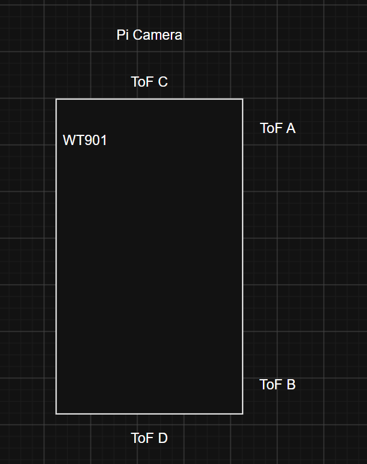

# Electrical and System Diagrams

This folder holds the diagrams for the robot's wiring, power layout, sensor placement, and data flow. Mechanical files like CAD and STL live elsewhere.

## Folder contents

```text
schemes/
├── README.md
├── complete_wiring_diagram.png
├── power_distribution.png
├── sensor_placement.png
├── communication_diagram.png
└── source/
    ├── complete_wiring_diagram.drawio
    ├── power_distribution.drawio
    ├── sensor_placement.drawio
    └── communication_diagram.drawio
```

The `.png` files are what render on GitHub. The `.drawio` files in `source/` are the editable originals, so anyone updating a diagram should edit those and re-export the PNG.

---

## Complete wiring diagram


Everything electrical on the robot: the Raspberry Pi 4B, the Pi Pico, the U2D2, both DYNAMIXEL motors, the WT901 gyro, the three VL53L0X rangefinders, the Pi Camera, the battery packs, the DC/DC converter, and the shared ground.

### Pico sensor wiring

The Pico owns both sensor buses, on separate I²C peripherals, so a fault on one can't stall the other.

**WT901 gyro, on I²C0 at address `0x50`:**

| WT901 | Pico |
|---|---|
| VCC | 3V3(OUT) |
| GND | GND |
| SDA | GP4 |
| SCL | GP5 |

**VL53L0X rangefinders, on I²C1:**

| ToF pin | Pico |
|---|---|
| VCC | 3V3(OUT) |
| GND | GND |
| SDA | GP2 (shared) |
| SCL | GP3 (shared) |

All three rangefinders share one I²C bus, and they all ship with the same factory address of `0x29`. So each one gets its own `XSHUT` line and the firmware assigns addresses at boot: pull every XSHUT low, bring one sensor up, confirm it answers at `0x29`, move it to a private address, confirm the new address responds, then do the next one.

| Sensor | XSHUT | Assigned address |
|---|---|---|
| A | GP18 | `0x2A` |
| B | GP19 | `0x2B` |
| C | GP20 | `0x2C` |
| D | GP21 | none — held low, never brought up |

Position D is wired but unused. `TOF_CONFIGS` in the firmware only lists A, B and C, and GP21 is explicitly driven low and left there, so D never gets an address at all.

### DYNAMIXEL wiring

The U2D2 is a communication adapter, not a power supply. It converts USB into the DYNAMIXEL TTL bus so the Pi can speak Protocol 2.0 to both motors over one daisy chain, at 57600 baud on `/dev/ttyUSB0`.

| Device | Role |
|---|---|
| U2D2 | USB ↔ DYNAMIXEL TTL bridge |
| Motor ID 1 | Drive |
| Motor ID 2 | Steering |

<!-- Confirm before submission: how motor power actually reaches the DYNAMIXEL chain — through a U2D2 Power Hub Board, or injected directly into the daisy chain. The diagram needs to show whichever it is. -->

---

## Power distribution


This one is only about power, voltage and ground. Data wires are on the wiring diagram instead.

Four rechargeable cells in two packs, through a switch on the holder, into the DC/DC converter. Everything downstream runs off that one regulated output.

```text
4 cells / 2 packs
  │
  ▼
switch on the battery holder
  │
  ▼
DC/DC converter
  ├── 5V → Raspberry Pi 4B
  │          ├── USB → U2D2
  │          └── USB → Pi Pico
  │
  └── motor power → DYNAMIXEL bus
                     ├── ID 1  drive
                     └── ID 2  steering
```

The Pico and the U2D2 are both powered over their USB links from the Pi, so neither needs its own tap off the converter. Sensor power comes off the Pico's own 3.3V regulator:

```text
Pico 3V3(OUT)
  ├── WT901 VCC
  ├── ToF A VCC
  ├── ToF B VCC
  └── ToF C VCC
```

Ground is common to everything:

```text
Shared GND
  ├── Raspberry Pi
  ├── Pi Pico
  ├── WT901
  ├── all ToF sensors
  ├── U2D2 reference
  └── DYNAMIXEL motors
```

The diagram labels the pack voltage and capacity, the converter's input and output voltage, the Pi's 5V input, the 3.3V sensor rail, and where motor power comes from.

Worth noting on this diagram: the motors and the compute boards share the converter output. The rules recommend a separate motor battery, and splitting them is our highest-priority hardware change, since a stall spike on either motor reaches the rail the Pi is running on.

<!-- Fill in before submission: cell chemistry, cells per pack, pack voltage, and the DC/DC output voltage and current rating. -->

---

## Sensor placement



A labeled top-down photo of the real robot works better here than a drawing.

The layout that matters most is A and B. **They both face the same side of the car**, at different points along its length, and that's the whole reason the parking code can tell rotation apart from distance. Their difference is how far the car is rotated relative to the wall, and their average is how far away it is. Two sensors on opposite sides would only tell us whether the car is centered, which isn't what the rules score.

```text
                 FRONT / driving direction
                            ↑
          ┌─────────────────────────────────┐
          │  [C] front ToF                  │
          │      GP20 / 0x2C                │
          │      faces forward  ────►       │
          │                                 │
  wall ◄──┤  [A] GP18 / 0x2A                │
  side    │                                 │
          │           WT901 gyro            │
          │           I2C0 / 0x50           │
          │                                 │
          │           Pi Camera             │
          │           forward view          │
          │            \  |  /              │
          │                                 │
  wall ◄──┤  [B] GP19 / 0x2B                │
  side    │                                 │
          │  [D] GP21, wired but held off   │
          └─────────────────────────────────┘

        A and B face the SAME wall, spaced apart
        along the length of the car:
          (A − B)      →  how rotated we are
          (A + B) / 2  →  how far from the wall
```

<!-- Confirm before submission: whether A and B face the left or the right side of the car, and update the diagram accordingly. -->

### What each sensor is for

| Sensor | Faces | Used for |
|---|---|---|
| A | Side wall, forward position | Squaring up against the wall, wall following, spotting the parking bay opening |
| B | Side wall, rear position | Paired with A for the rotation and distance terms |
| C | Forward | Front-wall approach during parking, which sets the reference for every stage after it |
| D | — | Unpopulated. Wired to GP21 and held low. |
| WT901 | — | Yaw. Tracks how far the car has turned, since one lap works out to roughly 360 degrees |
| Pi Camera | Forward | Training data and live input to the driving model |

The WT901 is mounted rigidly to the chassis, and that matters more than it sounds. The sensor reports its own rotation, so any movement of the sensor relative to the car reads as the car turning. A loose IMU mount shows up as lap-counting error, and lap counting is what ends the run.

The camera sits high enough that the chassis doesn't block the useful part of the frame.

<!-- Add to the diagram once measured: robot length and width, camera height, sensor heights, the spacing between A and B, C's distance from the front edge, and the WT901's offset from the center of rotation. The A-to-B spacing matters most, since it sets how many centimeters of difference a given rotation produces. -->

---

## Communication diagram


Data flow only, not power and not full wiring.

```text
Pi Camera ──────────► Raspberry Pi ──────────► U2D2 ─────► DYNAMIXEL
                           ▲                                ID 1 drive
                           │                                ID 2 steering
Pi Pico ───────────────────┘
   ▲
   ├── WT901 gyro          (I²C0)
   └── ToF A / B / C       (I²C1)

Sense HAT ─────────► Raspberry Pi     (GPIO header, model selection)
PS4 controller ────► Raspberry Pi     (USB, data recording only)
```

The PS4 controller is only there for recording training data. Nothing wireless is connected during a competition round, which the rules prohibit, so model selection at the field goes through the Sense HAT joystick on the GPIO header instead.

### What each link carries

| Link | Carries |
|---|---|
| Camera → Pi | Image frames. The trained model turns them into steering and throttle. |
| WT901 → Pico | Gyro rate and angle over I²C0, sampled at 100 Hz on core1 |
| ToF A/B/C → Pico | Distance readings over I²C1, read in sequence on core0 |
| Pico → Pi | One combined sensor frame over USB serial, `/dev/ttyACM0` at 115200 |
| Pi → Pico | Occasional commands over the same link: `restart main`, `reset gyro` |
| Pi → U2D2 | Motor commands over USB, `/dev/ttyUSB0` at 57600 |
| U2D2 → motors | DYNAMIXEL Protocol 2.0 on one TTL daisy chain |

The Pico's frame format is one line per update:

```text
Angle=X,A=X,AS=X,B=X,BS=X,C=X,CS=X
```

`Angle` is accumulated yaw in degrees. `A`, `B` and `C` are distances in centimeters, each followed by a status byte where `0` means the reading is good and `9` means out of range, a read error, or a sensor that never came up.

---

## Keeping these current

When wiring or sensor placement changes on the robot, edit the `.drawio` file in `source/`, re-export the PNG over the old one, and update whatever tables in this file the change affects. The pin and address tables above are the ones most likely to drift out of date, and they should always match `TOF_CONFIGS` and the wiring comments at the top of `main.py`.
